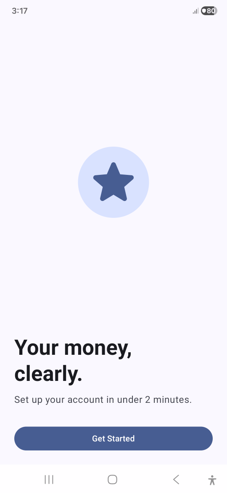
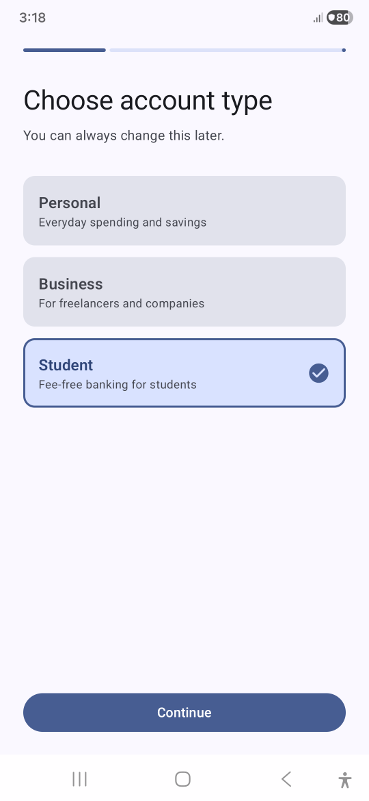
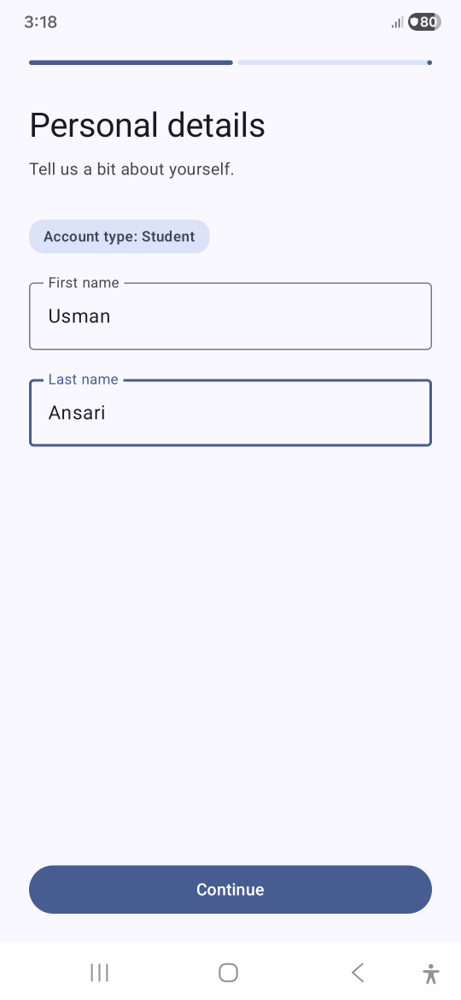
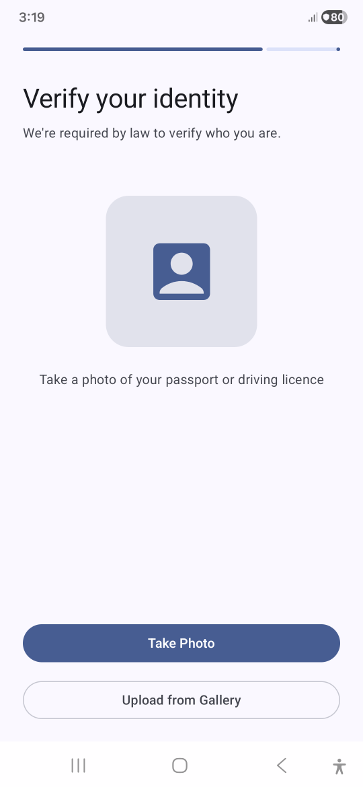
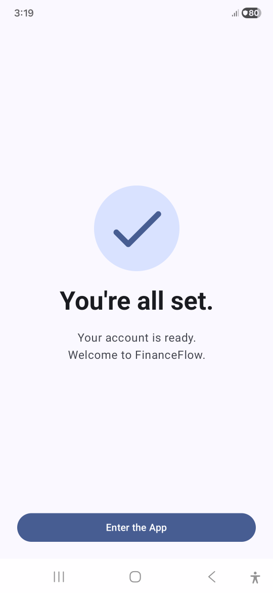
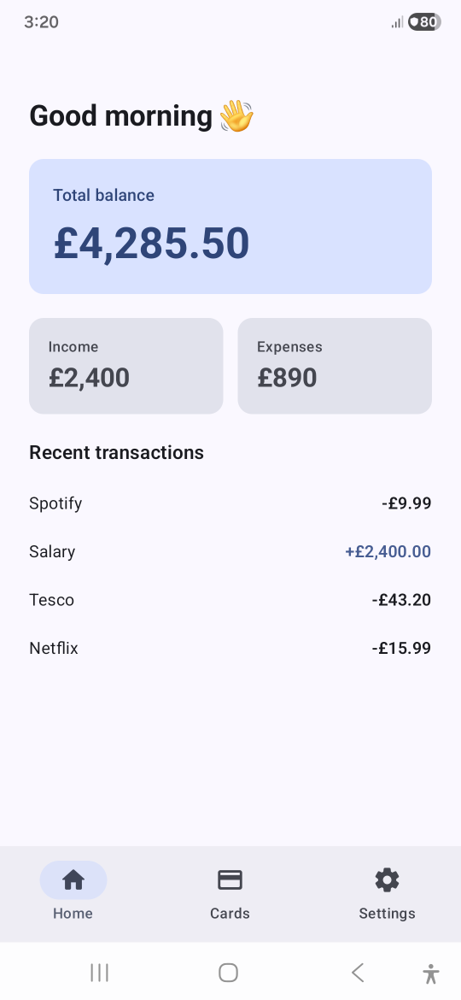

<div align="center">

# FinFlow

<p align="center">

</p>

[](https://kotlinlang.org)
[](https://developer.android.com)
[](https://developer.android.com/jetpack/compose)
[](https://developer.android.com/jetpack/compose/navigation)


## Fintech Onboarding Flow

### A focused navigation architecture project demonstrating nested navigation graphs, type-safe typed routes, graph-scoped ViewModel state, back stack management, and animated screen transitions

</div>

---

## 📱 What This App Does

FinFlow is a multi-step onboarding wizard for a fintech app. A user opens the app, moves through a 5-screen onboarding flow, and lands on a static dashboard with bottom navigation.

**All data is static.** There is no network layer, no database, and no remote API. The complexity budget of this project is spent entirely on navigation architecture and UI structure.

---

## 📸 Screenshots

<div align="center">

| Welcome | Choose Account | Personal Details |
|:-------:|:--------------:|:----------------:|
|  |  |  | 

 | ID Verification | Success | Dashboard |
 |:---------------:|:-------:|:---------:|
 |  |  |  |
</div>

---

## 🛠️ Tech Stack

| Category | Technology | Why This Choice |
|----------|-----------|-----------------|
| **Language** | Kotlin 2.3.21 | Serialization plugin, coroutines, null safety |
| **UI** | Jetpack Compose + Material 3 | Declarative UI, slot-based component design |
| **Navigation** | Navigation Compose 2.9.8 | Type-safe routes, nested graph support |
| **State** | ViewModel + StateFlow | Graph-scoped state, lifecycle-aware collection |
| **Serialization** | Kotlinx Serialization | Compile-time route encoding and argument safety |
| **Build** | Gradle KTS + Version Catalog | Centralised dependency management |

---

## 🏗️ Navigation Architecture

FinFlow uses two nested navigation graphs. Neither graph knows about the other's internal destinations — each owns its screens exclusively.

```
AppNavHost
    │
    ├── OnboardingGraph  (startDestination = Welcome)
    │       │
    │       ├── Welcome
    │       ├── ChooseAccountType
    │       ├── PersonalDetails(accountType: String)
    │       ├── IdVerification
    │       └── Success ──► navigate(MainGraph) { popUpTo(OnboardingGraph) { inclusive = true } }
    │
    └── MainGraph  (startDestination = Home)
            │
            ├── Home
            ├── Cards
            └── Settings
```

### Why Two Graphs Instead of a Flat List of Destinations

A flat `NavHost` with all destinations at the same level works for simple apps. It breaks down when:

- You need back stack isolation between features (onboarding should not share a back stack with the main app)
- You need graph-scoped ViewModel state (a ViewModel scoped to a flat destination is destroyed on navigation away)
- You need to pop an entire flow in a single operation (`popUpTo` on a graph destination removes everything inside it atomically)

Two graphs makes these problems structural rather than requiring workarounds at every call site.

---

## 🗺️ Screen Flow

```
[Welcome]
    │ onGetStarted()
    ▼
[Choose Account Type]
    │ onAccountTypeSelected(type: String)
    │ ── saves to OnboardingViewModel
    │ ── navigates to PersonalDetails(accountType = type)
    ▼
[Personal Details]
    │ receives accountType as typed route argument
    │ onContinue()
    ▼
[ID Verification]
    │ onVerified()
    ▼
[Success]
    │ BackHandler active ── back press consumed, does nothing
    │ onEnterApp()
    │ ── popUpTo(OnboardingGraph) { inclusive = true }
    ▼
[Dashboard]  ← onboarding graph is gone from back stack
    ├── Cards
    └── Settings
```

---

## 🔑 Key Implementation Decisions

### 1. Typed Routes with @Serializable

All navigation destinations are defined as `@Serializable` objects or data classes — not as strings.

```kotlin
@Serializable object OnboardingGraph
@Serializable object MainGraph

@Serializable object Welcome
@Serializable object ChooseAccountType
@Serializable data class PersonalDetails(val accountType: String)
@Serializable object IdVerification
@Serializable object Success

@Serializable object Home
@Serializable object Cards
@Serializable object Settings
```

**Why not strings?**

String-based routes (`"onboarding/personal_details/{accountType}"`) have no compiler support. A typo compiles silently and crashes at runtime. Argument types are not enforced — nothing prevents passing an Int where a String is expected. Renaming a destination requires finding every string reference manually.

Typed routes fail at compile time. The argument contract is enforced by the type system. Renaming a destination propagates automatically via IDE refactoring. `PersonalDetails` is a `data class` rather than an `object` specifically because it carries a constructor argument — this distinction makes the argument requirement explicit in the type definition.

### 2. Graph-Scoped ViewModel

`OnboardingViewModel` is scoped to `OnboardingGraph`, not to individual screens.

```kotlin
// Inside any onboarding composable destination
val parentEntry = remember(backStackEntry) {
    navController.getBackStackEntry<OnboardingGraph>()
}
val viewModel: OnboardingViewModel = viewModel(parentEntry)
```

**Why graph-scoped instead of screen-scoped?**

A screen-scoped ViewModel (`viewModel()` with no parent entry) is destroyed when you navigate away from that screen. If `ChooseAccountTypeScreen` owns its own ViewModel and the user navigates to `PersonalDetails` then presses back, a new ViewModel instance is created — the previously selected account type is gone.

Graph-scoped means the same ViewModel instance is shared across every screen in `OnboardingGraph`. It is created when the first screen in the graph is entered and destroyed automatically when `OnboardingGraph` is popped from the back stack — which happens at the moment the user enters the main app. No manual cleanup is required.

### 3. Back Stack Management with popUpTo

The transition from onboarding to the main app:

```kotlin
navController.navigate(MainGraph) {
    popUpTo(OnboardingGraph) { inclusive = true }
}
```

`inclusive = true` removes `OnboardingGraph` itself from the back stack, not just its children. Without this, pressing back from the dashboard would return the user to the `Success` screen. With it, the entire onboarding graph is removed atomically — the back press from the dashboard exits the app cleanly.

**The bug this prevents:** Without `popUpTo`, the back stack after completing onboarding looks like:

```
Bottom of stack
    OnboardingGraph
        Welcome
        ChooseAccountType
        PersonalDetails
        IdVerification
        Success          ← still here
    MainGraph
        Home             ← current
Top of stack
```

With `popUpTo(OnboardingGraph) { inclusive = true }`:

```
Bottom of stack
    MainGraph
        Home             ← current
Top of stack
```

### 4. BackHandler on the Success Screen

```kotlin
composable<Success> {
    BackHandler { /* intentionally consumed — onboarding is complete */ }
    SuccessScreen(onEnterApp = { ... })
}
```

The Success screen represents a completed state. Allowing back navigation here would return the user to ID Verification — a step that is already done and cannot be meaningfully repeated in the same session. `BackHandler` intercepts the system back gesture and discards it, making the forward-only nature of the completed flow explicit in code.

### 5. Symmetric Transitions

Each destination defines four transition parameters — not two:

```kotlin
composable<PersonalDetails>(
    enterTransition    = { slideInHorizontally { it } + fadeIn(tween(750)) },
    exitTransition     = { slideOutHorizontally { -it } + fadeOut(tween(750)) },
    popEnterTransition = { slideInHorizontally { -it } + fadeIn(tween(750)) },
    popExitTransition  = { slideOutHorizontally { it } + fadeOut(tween(750)) }
)
```

`enterTransition` and `exitTransition` control forward navigation animation. `popEnterTransition` and `popExitTransition` control back navigation animation. Without both pairs, back gestures produce incorrect animations — screens appear to slide in from the wrong direction, breaking the spatial model the user builds from forward navigation.

### 6. Slot Pattern in OnboardingScaffold

Three of six onboarding screens share the same layout skeleton: progress indicator, title, subtitle, scrollable content area, and a bottom CTA area. Rather than duplicating this structure, a single `OnboardingScaffold` composable owns the layout and exposes two content slots:

```kotlin
@Composable
fun OnboardingScaffold(
    title: String,
    subtitle: String,
    progress: Float,
    content: @Composable ColumnScope.() -> Unit,
    bottomContent: @Composable ColumnScope.() -> Unit
)
```

Each screen provides only what is unique to it. The progress value advances per screen (0.25 → 0.5 → 0.75 → 1.0) to give the user a sense of position within the flow. This is the same slot pattern used by Material 3's `Scaffold`, `TopAppBar`, and `Card` components.

---

## 📂 Project Structure

```
com.yourname.Finflow/
│
├── navigation/
│   ├── Routes.kt               ← all @Serializable route definitions
│   ├── AppNavHost.kt           ← root NavHost, wires both graphs
│   ├── OnboardingNavGraph.kt   ← NavGraphBuilder extension, onboarding flow
│   └── MainNavGraph.kt         ← NavGraphBuilder extension, main app tabs
│
├── ui/
│   ├── onboarding/
│   │   ├── OnboardingViewModel.kt   ← graph-scoped, StateFlow-backed
│   │   └── screens/
│   │       ├── WelcomeScreen.kt
│   │       ├── ChooseAccountTypeScreen.kt
│   │       ├── PersonalDetailsScreen.kt
│   │       ├── IdVerificationScreen.kt
│   │       └── SuccessScreen.kt
│   │
│   ├── main/
│   │   └── screens/
│   │       └── HomeScreen.kt
│   │
│   ├── components/
│   │   └── OnboardingScaffold.kt    ← shared layout slot component
│   │
│   └── theme/
│       └── Theme.kt
```

**Why each graph is a NavGraphBuilder extension function:**

```kotlin
fun NavGraphBuilder.onboardingGraph(navController: NavController) { ... }
fun NavGraphBuilder.mainGraph(navController: NavController) { ... }
```

Extension functions on `NavGraphBuilder` mean each graph is defined independently of `AppNavHost`. In a multi-module production codebase, the onboarding module would register its own graph — `AppNavHost` would call `onboardingGraph()` without knowing anything about its internal destinations. This project simulates that separation in a single module.

---

## 🧪 Back Stack Verification Checklist

Manual test cases that verify the navigation architecture is correct:

| Test | Expected Result | Verifies |
|------|----------------|----------|
| Complete full onboarding flow | Lands on Dashboard | `popUpTo` removes onboarding graph |
| Press back from Dashboard | App exits | Onboarding graph is fully removed |
| Press back on Success screen | Nothing happens | `BackHandler` is active |
| Select account type, navigate to Personal Details, press back | Account type still selected on return | Graph-scoped ViewModel persists state |
| Rotate device on Personal Details | Account type badge still correct | ViewModel survives config change |
| Press back from Choose Account Type | Returns to Welcome | Standard back stack behaviour |
| Complete onboarding, press back multiple times | App exits cleanly | No orphaned destinations |

---

## 🎓 What I Learned

<details>
<summary><b>Navigation Architecture</b></summary>

**Graphs are architectural boundaries, not cosmetic groupings** — A nested graph is not just a way to organise a long list of destinations. It creates a lifecycle boundary (ViewModel can be scoped to it), a back stack boundary (`popUpTo` can remove it atomically), and a module boundary (the graph can live in a separate feature module). Understanding this changes how you think about navigation at the feature level, not just the screen level.

**String routes feel fine until they break** — I built an earlier version with string routes. The first time I renamed a destination, I had three runtime crashes before finding all the string references. Typed routes make this a zero-crash refactor because the compiler flags every reference immediately.

**`startDestination` on a graph vs on a screen are different things** — The `startDestination` of the `NavHost` is the graph that owns the first screen, not the first screen itself. This distinction matters when you need to use `popUpTo` — you can only pop to a destination that is on the back stack, and a graph destination is on the stack even when its children change.

</details>

<details>
<summary><b>ViewModel Lifecycle and Navigation</b></summary>

**ViewModel scope is a deliberate architectural decision** — There is no single correct scope for a ViewModel. Screen-scoped makes sense for screens that own completely independent state. Graph-scoped makes sense for flows where state is shared across multiple steps. Activity-scoped makes sense for app-wide state like authentication. Getting this wrong produces either state loss bugs (scope too narrow) or memory leaks and stale state (scope too wide).

**remember(backStackEntry) matters** — Without `remember`, `getBackStackEntry` is called on every recomposition, potentially returning a different back stack entry as the back stack changes. `remember(backStackEntry)` ensures the parent entry reference is stable for the lifetime of the current destination.

</details>

<details>
<summary><b>Compose Transitions</b></summary>

**Four parameters, not two** — Most Navigation Compose examples only show `enterTransition` and `exitTransition`. Defining only these produces broken back-navigation animations. `popEnterTransition` is what the screen you're returning to plays as you navigate back. `popExitTransition` is what the current screen plays as it leaves during a back press. The four parameters together create a consistent spatial model where forward and backward navigation feel like moving through a physical space.

**Extracted transition definitions avoid repetition** — Defining the same four lambdas on every `composable<>` block is error-prone. Extracting them to file-level `val` declarations means changing the transition timing or style in one place updates every destination consistently.

</details>

<details>
<summary><b>Back Stack as a Data Structure</b></summary>

**The back stack is a stack you control, not one that controls you** — Every `navigate()` call is a push. Every `popBackStack()` is a pop. `popUpTo` is a slice that removes everything above a specific entry. Once you think of the back stack as a data structure with explicit operations, navigation bugs become diagnosable rather than mysterious.

**Reproduce bugs intentionally** — The most durable way to understand `popUpTo` is to remove it, observe the broken behaviour (onboarding screens reachable from the dashboard), then add it back and verify the fix. The understanding that results from seeing a bug and its fix in the same session outlasts any documentation.

</details>

---

### What's Implemented

| Feature | Status | Notes |
|---------|--------|-------|
| Typed route definitions | ✅ Complete | `@Serializable` objects and data classes |
| Nested navigation graphs | ✅ Complete | Onboarding and Main as separate graphs |
| Argument passing between screens | ✅ Complete | `PersonalDetails(accountType)` via typed route |
| Graph-scoped ViewModel | ✅ Complete | Scoped to `OnboardingGraph` |
| Back stack management | ✅ Complete | `popUpTo` clears onboarding on completion |
| BackHandler on Success | ✅ Complete | Back press consumed intentionally |
| Symmetric screen transitions | ✅ Complete | All four transition parameters defined |
| Bottom navigation (Main graph) | ✅ Complete | `NavigationBar` with state/restore |
| Slot-based layout component | ✅ Complete | `OnboardingScaffold` shared across 5 screens |


## 👤 Author

**Usman Ali Ansari**

- 💼 LinkedIn: [usman1ansari](https://www.linkedin.com/in/usman1ansari)

---

<div align="center">

**Built as a deliberate study of Navigation Compose architecture**

</div>
